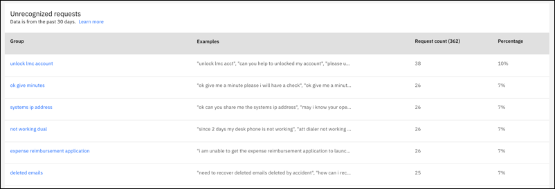
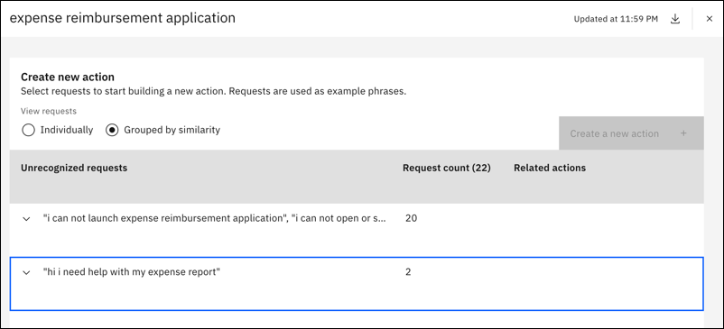
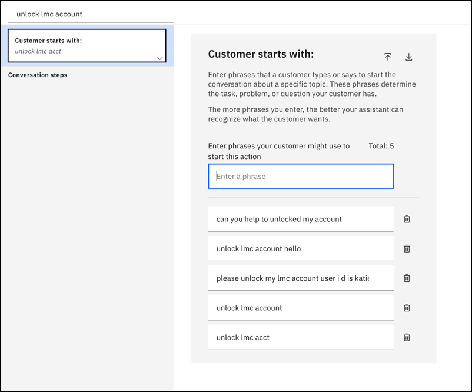

---

copyright:
  years: 2022, 2023
lastupdated: "2023-04-19"

subcollection: watson-assistant

---

{{site.data.keyword.attribute-definition-list}}

# Use unrecognized requests to get action recommendations
{: #analytics-recognition}

[IBM Cloud]{: tag-ibm-cloud}[Plus]{: tag-green}[Enterprise]{: tag-purple}

Use the **Recognition** page to analyze unrecognized requests. You can use this information to create new actions that address questions and issues that aren't being answered by your assistant.
{: shortdesc}

You can analyze unrecognized requests in English-language assistants on IBM Cloud only. You need a Plus plan or higher.
{: note}

*Recognition* measures the requests within a time period that are recognized and successfully routed to an action. Customer requests are considered unrecognized if:
- The request triggers the *No Action Matches* action
- The assistant asks a clarifying question and the customer chooses `None of the above` 

## Viewing groups of unrecognized requests
{: #analytics-recognition-view}

You can view groups of unrecognized requests for the draft or live environment. {{site.data.keyword.conversationshort}} generates groups of similar unrecognized requests from the last 30 days so that you can decide whether to add the requests as example phrases to a new action.

{: caption="Unrecognized requests" caption-side="bottom"}

The algorithm that generates groups considers several factors in creating the groups:
- Unrecognized requests that have fewer than 2 or more than 35 significant words are removed from consideration. Common words such as `my` or `is`, or punctuation such as `?`, are not considered significant. Phrases that are too short or too long are usually not effective as example training phrases for your assistant.
- The unrecognized requests are compared to the latest version of your actions so that requests that would no longer be unrecognized with your latest actions version are filtered out. 
- Groups for which the request count is less than 10 are excluded. But if this might result in less than 5 groups, the algorithm tries to produce groups that include more than 5 request counts until a total of 5 groups are produced.
- If you have a small volume of data, the algorithm allows examples closer to the existing training data for grouping.

As a result of the algorithm:
- A list of groups might not always appear
- The groups might not include all unrecognized requests that you see on the **Conversations** page

Several events cause your groups to be refreshed by using the latest data:
- The first time that you visit the **Recognition** page for a specific environment, {{site.data.keyword.conversationshort}} generates groups
- If it has been at least 1 day since the groups were last generated, or if you edit your actions in your draft environment, the groups are refreshed when you return to the **Recognition** page
- You can refresh the groups by using the **Refresh** icon 

This table explains the details of the list of groups:

| Column | Description |
| --- | --- |
| Group | A name is generated based on the example phrases in the requests. |
| Examples | Some of the unrecognized requests are shown as a preview. |
| Request count | The number of unrecognized requests in the group. Focus on groups with a higher count of unrecognized requests. |
| Percentage | The percentage of unrecognized requests relative to the other groups. Focus on groups with a higher percentage of unrecognized requests. |
{: caption="Unrecognized request groups list" caption-side="bottom"}

## Creating actions from unrecognized requests
{: #analytics-recognition-create-actions}

To create actions based on unrecognized requests:

1. Click a group to open its page. Each unrecognized request is listed individually. 

   | Column | Description |
   | --- | --- |
   | Unrecognized requests | Verbatim requests from customer conversations |
   | Request count | The number of times the unrecognized request is included in this group |
   | Related actions | Existing actions that you might modify to address the unrecognized request |
   {: caption="Unrecognized request group page" caption-side="bottom"}

1. If {{site.data.keyword.conversationshort}} identifies more similarities among the examples, you can click **Grouped by similarity** to further categorize the list.

   {: caption="Grouped by similarity" caption-side="bottom"}

   In a group named `expense reimbursement application`, requests might be further grouped by similarity. For example:
   - Problems logging in to or starting the expense reimbursement application
   - Issues with crashes of the expense reimbursement application
   - Requests for help or assistance with the expense reimbursement application

   These similarities can help you decide to add one or more actions that correspond to what you want to cover with your assistant, rather than adding all requests to a single action.

1. You can click to select unrecognized requests that you want to use as example phrases in a new action.

   {: caption="Select requests" caption-side="bottom"}

1. After you make your selections, click **Create new action**.

1. Enter a name for the action, or use the default, and then click **Apply**.

1. The action editor opens with each of the unrecognized requests that are included as an example phrase. You can now build an action to address these questions or issues.

   {: caption="Customer starts with" caption-side="bottom"}

### Modifying existing actions
{: #analytics-recognition-modify-actions}

You can also use the unrecognized request groups to identify existing actions that you might want to modify. You can:
- Add unrecognized requests as example phrases to existing actions
- Move example phrases from existing actions and add them to any new actions you create based on unrecognized requests

If a group lists related actions, you might focus on modifying them to address the unrecognized request.

{: caption="Related actions starts" caption-side="bottom"}

### Downloading groups
{: #analytics-recognition-download-group}

You can download all group data or individual group data in a CSV file.

To download all group data, click the **Download groups** icon on the **Recognition** page.

{: caption="Download groups" caption-side="bottom"}

To download data for an individual group, open the group, then click the **Download group** icon.

{: caption="Download group" caption-side="bottom"}

The CSV file includes this information:

| Column | Description |
| --- | --- |
| Group | The name of the unrecognized requests group |
| Example | Each verbatim request in the group |
| Count | The number of times the unrecognized request is included in this group |
| Group Id | ID number for the group |
| Similarity Group Id | ID number for any further grouping by similarity, for example, 1, 2, and 3 if there are three similarity groups |
| Example Id | ID number for the example within the group or similarity group |
{: caption="Download group CSV file" caption-side="bottom"}
