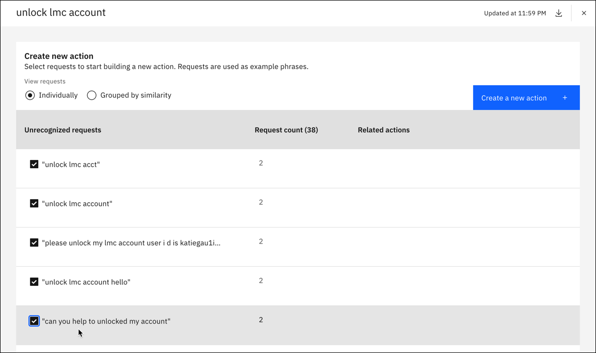

---

copyright:
  years: 2018, 2022
lastupdated: "2022-11-10"

subcollection: watson-assistant

---

{:shortdesc: .shortdesc}
{:new_window: target="_blank"}
{:external: target="_blank" .external}
{:deprecated: .deprecated}
{:important: .important}
{:note: .note}
{:tip: .tip}
{:pre: .pre}
{:codeblock: .codeblock}
{:screen: .screen}
{:javascript: .ph data-hd-programlang='javascript'}
{:java: .ph data-hd-programlang='java'}
{:python: .ph data-hd-programlang='python'}
{:swift: .ph data-hd-programlang='swift'}

{{site.data.content.classiclink}}

# Use unrecognized requests to get action recommendations
{: #analytics-recognition}

The **Recognition** page lets you analyze unrecognized requests. You can use this information to create new actions that address questions and issues that aren't being answered by your assistant.
{: shortdesc}

*Recognition* measures the requests within a given time period that are recognized and successfully routed to an action. Customer requests are considered unrecognized if:
- The request triggers the No Action Matches action
- The assistant asks a clarifying question and the customer chooses `None of the above` 

## Viewing groups of unrecognized requests
{: #analytics-recognition-view}

You can view groups of unrecognized requests for the draft or live environment. Once there are at least 50 unrecognized requests in the last 30 days, {{site.data.keyword.conversationshort}} can evaluate the data and attempt to generate groups of similar requests. 

To generate a group, there needs to be at least 10 examples that have similar meaning, so:
- The list of groups might not always appear
- The groups might not include all unrecognized requests

To refresh the groups, click the Refresh icon .

| Column | Description |
| --- | --- |
| Group | A name is generated based on the example phrases in the requests. |
| Examples | Some of the unrecognized requests are shown as a preview. |
| Request count | The number of unrecognized requests in the group. You should focus on groups with a higher count of unrecognized requests. |
| Percentage | The percentage of unrecognized requests relative to the other groups. You should focus on groups with a higher percentage of unrecognized requests. |
{: caption="Unrecognized request groups list" caption-side="bottom"}

## Creating actions from unrecognized requests
{: #analytics-recognition-create-actions}

To create actions based on unrecognized requests:

1. Click a group to open its page. Each unrecognized request is listed individually. 

   | Column | Description |
   | --- | --- |
   | Unrecognized requests | Verbatim requests from customer conversations |
   | Request count | The number of times the unrecognized request is included in this group |
   | Related actions | Existing actions that you might modify to address the unrecognized request |
   {: caption="Unrecognized request group page" caption-side="bottom"}

1. If {{site.data.keyword.conversationshort}} identifies additional similarities among the examples, you can click **Grouped by similarity** to further categorize the list.

   

   In a group named `expense reimbursement application`, requests might be further grouped by similarity, for example:
   - Problems logging into or launching the expense reimbursement application
   - Issues with expense reimbursement application crashing
   - Requests for help or assistance with the expense reimbursement application

   This can help you decide to add one or more actions that correspond to what you want to cover with your assistant, rather than adding all requests to a single action.

1. You can click to select unrecognized requests that you want to use as example phrases in a new action.

   

1. After you make your selections, click **Create new action**.

1. Enter a name for the action, or use the default, then click **Apply**.

1. The action editor opens with each of the unrecognized requests included as example phrases. You can now build an action to address these questions or issues.

   

### Modifying existing actions
{: #analytics-recognition-modify-actions}

You can also use the unrecognized request groups to identify existing actions that you might want to modify. You can:
- Add unrecognized requests as example phrases to existing actions
- Move example phrases from existing actions and add them to any new actions you create based on unrecognized requests

If a group lists related actions, you might focus on modifying them to address the unrecognized request.

### Downloading the group
{: #analytics-recognition-download-group}

For each unrecognized requests group, you can download the data in a CSV file. To download, click the **Download group** icon.

The CSV file includes this information:

| Column | Description |
| --- | --- |
| Group | The name of the unrecognized requests group you downloaded |
| Example | Each verbatim request in the group |
| Count | The number of times the unrecognized request is included in this group |
| Group Id | ID number for the group |
| Similarity Group Id | ID number for any further grouping by similarity, for example, 1, 2, and 3 if there are three similarity groups |
| Example Id | ID number for the example within the group or similarity group |
{: caption="Download group CSV file" caption-side="bottom"}

