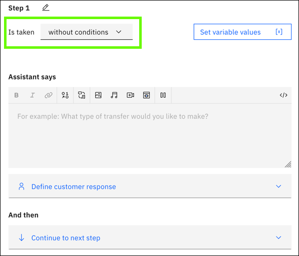

---

copyright:
  years: 2018, 2023
lastupdated: "2023-06-09"

subcollection: watson-assistant

---

{{site.data.keyword.attribute-definition-list}}

# Adding conditions to a step
{: #step-conditions}

An action represents a business process that helps customers answer their questions or solve their problems. Such a process must adapt to different specifics, based on information provided by customers or otherwise available at run time. For example, the steps for withdrawing money from a savings account might be slightly different from the steps for withdrawing for a checking account.

A step condition is a boolean test, based on some runtime value; the step executes only if the test evaluates as true. This test can be applied to any variable, such as an action variable containing the customer response from a previous step. By defining step conditions, you can create multiple pathways through an action based on different possible runtime values.

For more information about variables, see [Using variables to manage conversation information](/docs/watson-assistant?topic=watson-assistant-manage-info).

A basic step condition is expressed in the following form:

`If` `{variable}` `{operator}` `{value}`

where:

- `{variable}` is the name of a variable or an expression.
- `{operator}` is the type of test to apply to the variable value (for example, `is` or `is not`).
- `{value}` is the value to compare to the variable.

For example, a step condition might read:

`If` `Withdraw from which account?` `is` `Checking`

This condition evaluates as true if the customer's response to the previous `Withdraw from which account?` step is `Checking`.

Conditions can be grouped together to construct complex tests.

To add a step condition:

1.  Open the step. Click the condition field at the beginning of the step:

    {: caption="Condition field" caption-side="bottom"}

1. Select **with conditions** from the drop-down list. The **Conditions** section expands.

1. By default, a single condition group, containing a single condition, is automatically created based on the action variable stored by the most recent customer response.

    {: caption="Edit condition" caption-side="bottom"}

    You can click any part of the expression to edit it:

    - Select the variable you want to test. You can select any of the following:

      - An action variable storing the customer response from a previous step in the action
      - A session variable containing a value stored by any action
      - A built-in variable set by the assistant or by an integration

      You can also define a complex condition by writing an expression defining some other value. For more information about expressions, see [Writing expressions](/docs/watson-assistant?topic=watson-assistant-expressions).
      {: note}

    - Select the operator representing the test you want to perform on the variable (for example, `is` or `is not`). The available operators for a particular value depend upon its data type. (For more information, see [Operators](#step-conditions-operators).)

    - Select the value you want to evaluate the test against. Again, the values available depend upon the type of value you are testing. For example, a variable containing an options response can be tested against any of the defined options, and a date value can be tested against any date.

1.  To add more than one condition to a step, after adding a condition, click **New condition group**.

    One use case where using more than one condition is helpful is if you need to capture a value range. For example, maybe a requirement of opening a checking account is that the customer deposit at least $100 into the account at creation time. You might ask the customer if they want to transfer funds to the account, and if so, how much? To continue with the transfer, the transfer amount must be $100 or more, but cannot exceed $1000. You can add a step with the following conditions:

    - `How much to transfer?` `>` `99`
    - `How much to transfer?` `<` `1001`

    Specify whether all or any of the conditions must be met for the step to be included in the conversational flow.

1.  To add another group of conditions, click **Add new group**.

    You can use groups to build complex step conditions. Each group is evaluated true or false as a whole, and then these results are evaluated together. For example, you might build a step that executes only if all conditions in group 1 are true *or* any condition in group 2 is true. (Groups function like parentheses in the boolean conditions of many programming languages.)

    After you add a group, you can define one or more conditions in the new group. Between groups, choose **and** or **or** to indicate whether the conditions in both conditional groups or only one of them must be met for the step to be included in the conversational flow.

## Operators
{: #step-conditions-operators}

An operator specifies the kind of test you are performing on a value in a condition. The specific operators available in a condition depend on the customer response type of the value, as shown in the following table.

| Response type                        | Operators                           |
|--------------------------------------|-------------------------------------|
| - Options                            | - is\n- is not\n- is any of\n- is none of |
| - Regex                              | - is\n- is not                      |
| - Number\n- Currency\n- Percent      | - is defined\n- is not defined\n- is equal to (==)\n- is not equal to (≠)\n- is less than (&lt;)\n- is less than or equal to (&lt;=)\n- is greater than (&gt;)\n- is greater than or equal to (&gt;=) |
| - Date                               | - is defined\n- is not defined\n- is on (also allows specific day of the week)\n- is not on\n- is before\n- is after\n- is on or before\n- is on or after |
| - Time                               | - is defined\n- is not defined\n- is at\n- is not at\n- is before\n- is after\n- is at or before\n- is at or after |
| - Free text                          | - is\n- is not\n- contains\n- does not contain\n- matches\n- does not match |
{: caption="Operators" caption-side="top"}
